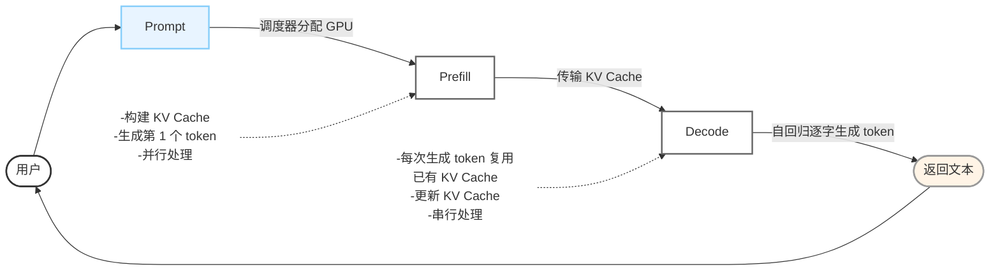
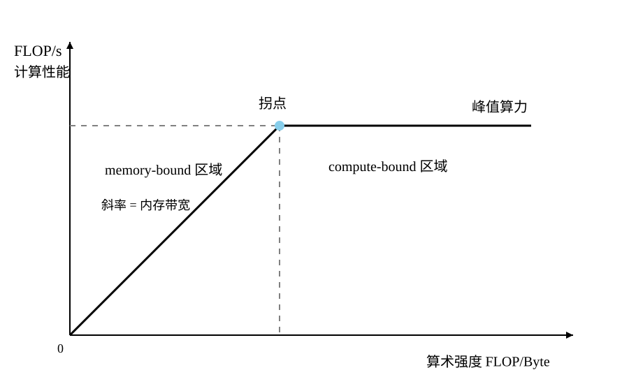

# 训练与推理

**训练**：并行优化参数

**推理**：串行逐步输出

# Scaling Law

---

$$
C = 6ND
$$

> C：训练计算量；N：模型参数；D：训练数据量
>
> - C = 2ND（前向传播）+ 4ND（反向传播）

---

$$
D:N ≈ 20:1
$$

> 训练数据量与参数量之比约为20：1效果最好

---

# Prefill与Decode

- **请求调度**：用户输入一段 Prompt。推理引擎的调度器，比如 SGLang scheduler 等将请求分配到可用的 GPU 或 GPU 组上；
- **Prefill 阶段**：对分配到的整段 Prompt 完成一次计算。模型并行处理所有输入 token，计算出完整的 KV cache，并采样出第一个输出 token。这一阶段计算量大、并行度高；
- **Decode 阶段**：进入自回归生成阶段。每次只输入上一个生成的 token，结合已有的 KV cache 进行前向计算，生成下一个 token，同时将新 token 的 KV 追加到 cache 中。重复此过程，直到遇到结束符（EOS）或达到最大生成长度。这一阶段计算量小，但需要频繁访问不断增长的 KV cache；
- **输出返回**：将生成的 token ID 序列解码为文本，返回给用户。

# Prefill

## 1. 单次完整前向处理 1 个批次的 FLOPs 估算

> 假设N = 3000个token（输入为3000个token），d = 4096（隐藏层维度，即每个token向量的维度），FFN中间计算维度8/3d(升维），L = 32（transformer有32层）

### 一个矩阵乘法的 FLOPs 算法：

$A_{m\times k}B_{k\times n}$ 结果是一个 $m\times n$ 的矩阵，结果矩阵里的每个元素，要做k次乘法，k-1次加法，共计2k-1次运算，可以粗略为2k次运算。然后每个矩阵有 $m\times n$ 个元素，所以一次矩阵运算会有**$2kmn$**次运算。

---

根据上述推导：

一次完整前向传播主要包括三个计算：

### 1. QKVO

>Q = X · $W_{Q}$	K = X · $W_{K}$	V  = X · $W_{V}$
>
>X就是输入矩阵，形状是（N × d）
>
>$W_{Q}$，$W_{K}$，$W_{V}$ 的形状都是（d × d）

$$
\boxed{ Q,K,V,O:\quad (N\times d)(d\times d) }
$$

4个线性层，即 $4\times(2\times d\times N\times d)=8Nd^2$

### 2. FFN

> $d_{ff}$ = 8 / 3

$$
\boxed{ FFN升维:\quad (N\times d)(d\times d_{ff}) }
$$

$$
\boxed{ FFN降维:\quad (N\times d_{ff})(d_{ff}\times d) }
$$

两个升维+一个降维，即 $2\times(2\times d\times N\times \frac{8}{3}d)+2\times\frac{8}{3}d\times N\times d=16Nd^2$

### 3. Attention

> $\mathrm{Attention}(Q,K,V)=\mathrm{Softmax}\left(\frac{QK^T}{\sqrt{d}}\right)V$

$$
\boxed{ QK^T:\quad (N\times d)(d\times N) }
$$

$$
\boxed{ \text{score}V:\quad (N\times N)(N\times d) }
$$

$Q\cdot K^T+\text{score}\cdot V$，即 $2\times d\times N\times N+2\times N\times N\times d=4N^2d$

---

**单层 FLOPs = $24Nd^2+4N^2d$**

**总 FLOPs = 单程 FLOPs × L = $(24Nd^2+4N^2d)\times L$**

所以如果带入 $N=3000,\ d=4096,\ L=32$

> **32 层总计算量 = 32 ×（线性投影 + FFN 项 + Attention 项）≈ **43.4 TFLOPs****
>
> ——大约相当于一台 A100 G40（312 TFLOPS 峰值）理论全力计算约 **0.14 s** 的工作量，但是实际无法达到 100% 使用率。

在中等长度（几千 token）时，计算量基本随 N **近似线性增长**；当 Prompt 变得很长时，Attention 的二次项会让计算量加速上涨。

---

> **compute-bound**：算力不够	**memory-bound**：带宽不够

## 2.内存流量分析

LLaMA-7B 模型权重为 FP16，如果权重用 FP16 存储，每个参数占 2 byte，内存占用又以下几部分组成：

- **模型权重**：

  $$
  7\times 10^9 \times 2\text{ bytes} \approx 14\text{ GB}
  $$

- **KV Cache 写入**：

  每个 token 的 KV Cache 大小粗略是：

  $$
  2\times L\times d\times 2\text{ bytes}
  $$

  > 第一个 $2$：K 和 V 两份
  >
  > $L=32$：32 层
  >
  > $d=4096$：隐藏维度
  >
  > 最后 $2\text{ bytes}$：FP16 每个数占 2 byte

  代入：

  $$
  2\times32\times4096\times2 = 524288\text{ bytes} ≈0.5\text{MB}/\text{token}
  $$

  如果一次Prefill处理3000个token：

  $$
  3000\times0.5\text{ MB} = 1500\text{ MB} = 1.5\text{ GB}
  $$

- **激活值**：相对较小，可忽略

所以总内存流量约

$$
14\text{GB}+1.5\text{GB} = 15.5\text{GB}
$$

约为 **15-16 GB**。

---

$$
\boxed{ \text{算术强度} = \frac{\text{FLOPs}}{\text{内存访问字节数}} }
$$

$$
\frac{43.4\times10^{12}} {15.5\times10^9} \approx2800 (次FLOPs/每byte)
$$

结合前面计算的 43.4 TFLOPs，这意味着平均每从显存读取 1 字节的数据，会执行数千次浮点运算。

---

通过以上的数据分析可以感受到：

- Prefill 的计算量很大，且随 Prompt 长度明显增加
- 模型权重只需要加载一次，就可以服务大量 token 的一次前向计算

GPU 的计算单元会被充分使用，算术强度比较高。

所以后面通常会说：**Prefill 更偏compute-bound，而 Decode 更偏memory-bound。**

---

# Decode

## 1.单次完整浮点运算处理 1 个批次的估算

同理可得，一次完整前向传播主要包括三个计算：

> Decode的N为1

### 1. QKVO

>Q = X · $W_{Q}$	K = X · $W_{K}$	V  = X · $W_{V}$
>
>X就是输入矩阵，形状是（N × d）
>
>$W_{Q}$，$W_{K}$，$W_{V}$ 的形状都是（d × d）

$$
\boxed{ Q,K,V,O:\quad (N\times d)(d\times d) }
$$

4个线性层，即 $4\times(2\times d\times N\times d)=8Nd^2 = 8d^{2}$

### 2. FFN

> $d_{ff}$ = 8 / 3

$$
\boxed{ FFN升维:\quad (N\times d)(d\times d_{ff}) }
$$

$$
\boxed{ FFN降维:\quad (N\times d_{ff})(d_{ff}\times d) }
$$

两个升维+一个降维，即 $2\times(2\times d\times N\times \frac{8}{3}d)+2\times\frac{8}{3}d\times N\times d=16Nd^2 = 16d^{2}$

### 3. Attention

> $\mathrm{Attention}(Q,K,V)=\mathrm{Softmax}\left(\frac{QK^T}{\sqrt{d}}\right)V$

$$
\boxed{ QK^T:\quad (1\times d)(d\times S) }
$$

$$
\boxed{ \text{score}V:\quad (1\times S)(S\times d) }
$$

$Q\cdot K^T+\text{score}\cdot V$，即 $2\times d\times 1\times S+2\times S\times 1\times d=4Sd$

其中 S 是当前序列长度（需要 attend 的历史 token 数）。以生成第 1 个输出 token 为例（S = 3000）：

---

所以Decode的运算量为：

$$
\begin{aligned}
\text{Decode FLOPs/层}
&= 8d^2 + 16d^2 + 4Sd \\
&= 24d^2 + 4Sd \\
&= 24\times4096^2 + 4\times3000\times4096 \\
&= 4.0\times10^8 + 4.9\times10^7 \\
&\approx 4.49\times10^8\text{ FLOPs/层}
\end{aligned}
$$

$$
\begin{aligned}
\text{32层总 FLOPs}
&= 32\times4.49\times10^8 \\
&\approx 1.44\times10^{10}\text{ FLOPs} \\
&\approx 14.4\text{ GFLOPs}
\end{aligned}
$$

按照 A100 G40 的巅峰算力值计算，理论计算时间仅约 **0.05 ms**。但实际耗时远超这个值，不过更大的问题是显存占用。

## 2.内存流量分析

Decode 阶段每生成 1 个 token 需要：

- **模型权重**：

  $$
  7\times 10^9 \times 2\text{ bytes} \approx 14\text{ GB}
  $$
- **KV Cache读取**：**1.5 GB**（S = 3000 时的初始大小）

- **KV Cache 写入**：

  每个 token 的 KV Cache 大小粗略是：

  $$
  2\times L\times d\times 2\text{ bytes}
  $$

  > 第一个 $2$：K 和 V 两份
  >
  > $L=32$：32 层
  >
  > $d=4096$：隐藏维度
  >
  > 最后 $2\text{ bytes}$：FP16 每个数占 2 byte

  代入：

  $$
  2\times32\times4096\times2 = 524288\text{ bytes} ≈0.5\text{MB}/\text{token}
  $$

  所以1个新 token 的 KV 写入：约 **0.5 MB**

- **激活值**：相对较小，可忽略

所以总内存流量约

$$
14\text{GB}+1.5\text{GB} + 0.5\text{MB} \approx 15.5\text{GB}
$$

---

$$
\boxed{ \text{算术强度} = \frac{\text{FLOPs}}{\text{内存访问字节数}} }
$$

$$
\frac{14.4\times10^{9}} {15.5\times10^9} \approx0.93 (次FLOPs/每byte)
$$

也就是说：搬 1 Byte 数据，只做不到 1 次 FLOP。

|          | Prefill                 | Decode（1 token）       |
| -------- | ----------------------- | ----------------------- |
| 内存流量 | $\approx15.5$ GB      | $\approx15.5$ GB      |
| 计算量   | 43.4 TFLOPs             | 14.4 GFLOPs             |
| 算术强度 | $\approx2800$ FLOPs/B | $\approx0.93$ FLOPs/B |

假设 A100：

$$
312\text{ TFLOPS}
$$

显存带宽：

$$
1.6\text{ TB/s}
$$

Decode 的理论计算时间计算量只有：

$$
14.4\text{ GFLOPs}
$$

，所以如果 Tensor Core 100% 满载：

$$
\begin{aligned} T_{\text{compute}} &= \frac{14.4\times10^9} {312\times10^{12}}\\ &\approx0.000046\text{ s}\\ &\approx0.046\text{ ms} \end{aligned}
$$

理论上计算只需要：

$$
\boxed{0.046\text{ ms}}
$$

，

但是把 15.5 GB 从 HBM 搬过来，需要：

$$
\begin{aligned} T_{\text{memory}} &= \frac{15.5\text{ GB}} {1600\text{ GB/s}}\\ &\approx0.0097\text{ s}\\ &=9.7\text{ ms} \end{aligned}
$$

，于是：

$$
\boxed{ T_{\text{memory}}\approx9.7\text{ ms} \gg T_{\text{compute}}\approx0.046\text{ ms} }
$$

差了大约：

$$
\frac{9.7}{0.046}\approx211
$$

倍。

所以 GPU 会变成这种状态：

> Tensor Core：我 0.046 ms 就能把活干完。
> HBM：等一下，我搬数据要 9.7 ms。
> Tensor Core：那我只能等你。

**GPU 的计算单元无法得到充分利用**。

---

## 3.KV Cache 累积问题

每个 token 的 KV Cache 大小粗略是：

$$
2\times L\times d\times 2\text{ bytes}
$$

> 第一个 $2$：K 和 V 两份
>
> $L=32$：32 层
>
> $d=4096$：隐藏维度
>
> 最后 $2\text{ bytes}$：FP16 每个数占 2 byte

- 生成第 1 个 token 后，1.5 GB + 0.5 MB ≈ 1.5 GB
- 生成第 100 个 token 后，1.5 GB + 50 MB ≈ 1.55 GB
- 生成第 2000 个 token 后，1.5 GB + 1000 MB ≈ 2.5 GB

生成一个新 token，需要读取的 KV Cache 体积在增大，进一步加重内存流量与带宽压力。

---

Decode 阶段浮点运算远小于同场景中的 Prefill，但每次生成 1 个 token 都需要读取完整模型权重 + 不断增长的 KV Cache，算术强度极低。**速度瓶颈主要来自内存带宽，容量瓶颈则来自 KV Cache 的持续累积**。

---

# Roofline model 原理

- **横轴**：算术强度（Arithmetic Intensity, AI），单位 FLOP/Byte ，每从 HBM 搬 1 Byte 数据，能做多少次浮点运算。

  $$
  AI
    =
    \frac{\text{总浮点运算次数（FLOPs）}}
    {\text{总内存访问量（Bytes）}}
  $$

  越往右，表示**数据复用率越高、计算越密集**。

  - Prefill：约 $2800$ FLOP/Byte
  - 单 token Decode：约 $1$ FLOP/Byte

  所以 Prefill 会在图上靠右，而 Decode 会靠左。

- **纵轴**：实际性能（Performance），单位 FLOP/s ，GPU 每秒实际上能够完成多少浮点运算，这个值始终不会超过硬件的峰值算力。

- **斜率**：由于内存带宽限制，你最多可以获得：

  $$
  \boxed{ P_{\text{memory}} = B\times AI }
  $$

  （B:带宽，每秒搬运的比特，AI：程序算数强度，每个比特做多少运算，乘起来就是每秒做多少运算）

  即：

  $$
  \boxed{ \text{性能} = \text{内存带宽} \times \text{算术强度} }
  $$

  ，所以这是一条直线：

  $$
  y=Bx
  $$

  因此，斜率 = 内存带宽

- **拐点**：compute-bound 与 memory-bound 的分界线

  拐点就是带宽和算数强度的乘积刚好达到硬件性能上线时的算数强度：

  $$
  B\times AI=P_{\max}
  $$

$$
\text{拐点}
=
\frac{\text{峰值算力 }(\mathrm{FLOP/s})}
{\text{理论 HBM 带宽 }(\mathrm{Byte/s})}
$$

​	物理含义：当算术强度达到这个临界值时，硬件的计算能力和内存带宽恰好达到平衡状态。

 Roofline 的完整公式其实是：

$$
\boxed{ P = \min \left( P_{\max}, B\times AI \right) }
$$

拐点值将 Roofline 图分为左右两个区域，左侧是 memory-bound ，右侧是 compute-bound。

将计算出的 AI 值与拐点进行比较：

- **AI < 拐点，实际性能 ≈ AI × 内存带宽** (memory-bound) 。GPU 理论上还有很多计算能力，但是 HBM 不能足够快地把数据送给计算单元。特征就是计算单元"等"数据，大量时间消耗在内存读写上；
- **AI ≥ 拐点，实际性能 ≈ 峰值算力** (compute-bound)。特征是内存供给充足，计算单元满负荷运转。

## GEMM 的算术强度分析

假设有两个矩阵 A、B，形状分别为 M×K 和 K×N ，计算 C=A×B 得到 M×N 的结果矩阵。以 bf16（每个元素 2 byte）为例，分析这个过程的计算量和数据搬运量：

**浮点运算**：

$$
FLOPs=2×M×K×N
$$

**数据搬运量**：

$$
Bytes=(M×K+K×N+M×N)×2
$$

所以：

$$
AI
=
\frac{\mathrm{FLOPs}}{\mathrm{Bytes}}
=
\frac{2MKN}{(MK+KN+MN)\times 2}
=
\frac{MKN}{MK+KN+MN}
$$

**M,N,K↑，AI↑，所以矩阵越大，AI 越大，越容易达到拐点**

